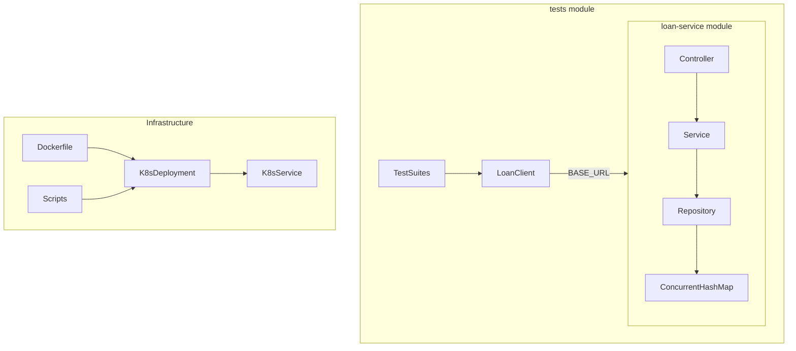

# Loan Service — Implementation Plan

## Current State

The repository [`qa-architecture-lab`](.) is empty (git only). Everything will be created greenfield.

## Repository Layout

Multi-module Maven parent with a clear separation between the application and API tests:

```text
qa-architecture-lab/
├── pom.xml                          # Parent POM (modules: loan-service, tests)
├── loan-service/                    # Spring Boot application
│   ├── pom.xml
│   └── src/
│       ├── main/java/com/qa/loanservice/
│       └── test/java/com/qa/loanservice/
├── tests/                           # REST Assured API automation (separate module)
│   ├── pom.xml
│   └── src/test/java/com/qa/tests/
├── k8s/                             # Kubernetes manifests
├── scripts/                         # Deployment validation, k3d helpers
├── Dockerfile                       # Multi-stage build at repo root
├── .gitignore
└── README.md
```

This layout supports future additions (`helm/`, `.github/workflows/`, `argocd/`) without restructuring.



---

## Phase 1 — Spring Boot API

**Goal:** Working REST API with in-memory storage, validation, error handling, and Actuator.

### 1.1 Maven & Spring Boot bootstrap

Create parent [`pom.xml`](pom.xml) and [`loan-service/pom.xml`](loan-service/pom.xml):

- Java 21, Spring Boot 3.3.x (latest stable 3.x)
- Dependencies: `spring-boot-starter-web`, `spring-boot-starter-validation`, `spring-boot-starter-actuator`, `spring-boot-starter-test`
- Main class: `com.qa.loanservice.LoanServiceApplication`

### 1.2 Domain model

| Class | Location | Notes |
|-------|----------|-------|
| `Loan` | `model/Loan.java` | `id`, `customerName`, `amount`, `status` |
| `LoanStatus` | `model/LoanStatus.java` | Enum: `PENDING`, `APPROVED`, `REJECTED` |
| `CreateLoanRequest` | `model/requests/CreateLoanRequest.java` | `@NotBlank`, `@Size(2,100)`, `@NotNull`, `@Positive`, `@Max(10_000_000)` |
| `UpdateLoanStatusRequest` | `model/requests/UpdateLoanStatusRequest.java` | `@NotNull` status enum |

### 1.3 Repository layer (DB-ready interface)

```java
// LoanRepository.java — interface, not tied to in-memory impl
Optional<Loan> findById(Long id);
List<Loan> findAll();
Loan save(Loan loan);
boolean deleteById(Long id);
boolean existsById(Long id);
```

[`InMemoryLoanRepository`](loan-service/src/main/java/com/qa/loanservice/repository/InMemoryLoanRepository.java): `@Repository`, `ConcurrentHashMap<Long, Loan>`, `AtomicLong` for ID generation.

**Seed data** on startup via `@PostConstruct` or `ApplicationRunner`:

- `101` — Rahul — 500000 — APPROVED
- `102` — Amit — 300000 — PENDING

### 1.4 Service layer

[`LoanService`](loan-service/src/main/java/com/qa/loanservice/service/LoanService.java):

- `getAllLoans()`, `getLoanById(id)`, `createLoan(request)`, `updateStatus(id, request)`, `deleteLoan(id)`
- Throws `LoanNotFoundException` for missing IDs
- New loans get auto-generated ID and `PENDING` status
- Structured log lines: `operation`, `loanId`, `status`, `duration` (no full customer PII beyond name in create logs)

### 1.5 Controller

[`LoanController`](loan-service/src/main/java/com/qa/loanservice/controller/LoanController.java) at `/api/loans`:

| Method | Path | Status |
|--------|------|--------|
| GET | `/api/loans` | 200 |
| GET | `/api/loans/{id}` | 200 / 404 |
| POST | `/api/loans` | 201 |
| PUT | `/api/loans/{id}/status` | 200 / 404 |
| DELETE | `/api/loans/{id}` | 204 / 404 |

### 1.6 Exception handling

- [`LoanNotFoundException`](loan-service/src/main/java/com/qa/loanservice/exception/LoanNotFoundException.java) → 404
- [`GlobalExceptionHandler`](loan-service/src/main/java/com/qa/loanservice/exception/GlobalExceptionHandler.java) (`@RestControllerAdvice`):
  - `MethodArgumentNotValidException` → 400 with field messages
  - `HttpMessageNotReadableException` (malformed JSON) → 400
  - Consistent body: `{ timestamp, status, error, message, path }`

### 1.7 Configuration

[`application.yml`](loan-service/src/main/resources/application.yml):

```yaml
server:
  port: ${SERVER_PORT:8080}

spring:
  application:
    name: loan-service

app:
  env: ${APP_ENV:local}

management:
  endpoints:
    web:
      exposure:
        include: health,info
  endpoint:
    health:
      show-details: never   # UP only for probes
```

Profile-specific files (optional, lightweight): `application-docker.yml`, `application-kubernetes.yml` activated via `APP_ENV`.

[`InfoContributor`](loan-service/src/main/java/com/qa/loanservice/config/AppInfoContributor.java) for `/actuator/info` (app name, version, environment).

### Phase 1 exit criteria

```bash
cd loan-service && mvn spring-boot:run
curl http://localhost:8080/actuator/health   # {"status":"UP"}
curl http://localhost:8080/api/loans          # seeded loans
```

---

## Phase 2 — Unit Tests

**Goal:** Fast, isolated tests inside the `loan-service` module.

| Test class | Scope | Key cases |
|------------|-------|-----------|
| `LoanServiceTest` | Service + mocked repo | CRUD, not-found, status update, ID generation |
| `InMemoryLoanRepositoryTest` | Repository | Save, find, delete, concurrency basics |
| `LoanControllerTest` | `@WebMvcTest` | All endpoints, 400/404 responses, validation |
| `GlobalExceptionHandlerTest` | Handler | Error body shape |

Use JUnit 5 + Mockito. Target >80% coverage on service and controller layers.

---

## Phase 3 — Docker

**Goal:** Production-style container image.

### [`Dockerfile`](Dockerfile) (multi-stage)

1. **Build stage:** `eclipse-temurin:21-jdk-alpine`, copy parent + `loan-service/`, run `mvn -pl loan-service -am clean package -DskipTests`
2. **Runtime stage:** `eclipse-temurin:21-jre-alpine`
   - Create non-root user `appuser`
   - Copy only `loan-service/target/*.jar` as `app.jar`
   - `EXPOSE 8080`
   - `HEALTHCHECK` curling `/actuator/health` (install `curl` in alpine or use `wget`)
   - `USER appuser`
   - `ENTRYPOINT ["java", "-jar", "/app/app.jar"]`

### [`.dockerignore`](.dockerignore)

Exclude `tests/`, `.git/`, `target/`, `k8s/`, IDE files.

### Phase 3 exit criteria

```bash
mvn clean package -pl loan-service -am
docker build -t loan-service:1.0 .
docker run -p 8080:8080 -e APP_ENV=docker loan-service:1.0
```

---

## Phase 4 — Kubernetes (k3d)

**Goal:** 3-replica deployment accessible locally via k3d.

### Manifests under [`k8s/`](k8s/)

| File | Contents |
|------|----------|
| [`namespace.yaml`](k8s/namespace.yaml) | `loan-service` namespace |
| [`configmap.yaml`](k8s/configmap.yaml) | `APP_ENV=kubernetes`, `SERVER_PORT=8080` |
| [`deployment.yaml`](k8s/deployment.yaml) | 3 replicas, image `loan-service:1.0`, `imagePullPolicy: IfNotPresent`, port 8080, env from ConfigMap, resources (requests: 256Mi/250m, limits: 512Mi/500m), readiness + liveness probes on `/actuator/health` |
| [`service.yaml`](k8s/service.yaml) | `type: LoadBalancer`, selector `app: loan-service`, port 8080 |

### k3d workflow (documented in README)

```bash
k3d cluster create qa-lab --port "8080:80@loadbalancer"
docker build -t loan-service:1.0 .
k3d image import loan-service:1.0 -c qa-lab   # critical for local image
kubectl apply -f k8s/
kubectl -n loan-service get pods,svc
```

Service URL for tests: `http://localhost:8080` (via k3d load balancer mapping).

### Phase 4 exit criteria

- 3/3 pods Running and Ready
- `curl http://localhost:8080/api/loans` returns seeded data

---

## Phase 5 — REST Assured API Automation

**Goal:** Separate [`tests/`](tests/) module with reusable client, test data, and tagged suites.

### [`tests/pom.xml`](tests/pom.xml)

- Dependencies: REST Assured, JUnit 5, AssertJ, Jackson (if needed)
- Surefire plugin with JUnit Platform groups/tags
- No dependency on `loan-service` source — tests hit running deployment only

### Package structure

```text
tests/src/test/java/com/qa/tests/
├── base/BaseApiTest.java          # @BeforeAll: read BASE_URL, RestAssured config
├── clients/LoanClient.java        # getLoans(), getLoan(id), createLoan(), updateStatus(), deleteLoan()
├── models/LoanResponse.java       # POJO for deserialization
├── utils/TestConfig.java          # BASE_URL from env; -Denv=local|docker|kubernetes
├── utils/TestDataFactory.java     # validLoan(), invalidLoan(), zeroAmount(), etc.
└── tests/
    ├── smoke/SmokeTests.java
    ├── functional/FunctionalTests.java
    ├── negative/NegativeTests.java
    └── regression/RegressionSuite.java  # @IncludeTags or suite aggregator
```

### Test tagging (JUnit 5 `@Tag`)

| Tag | Maven command |
|-----|---------------|
| `smoke` | `mvn test -pl tests -Dgroups=smoke` |
| `functional` | `mvn test -pl tests -Dgroups=functional` |
| `negative` | `mvn test -pl tests -Dgroups=negative` |
| `regression` | `mvn test -pl tests` (all tests) |

### Environment config

[`TestConfig.java`](tests/src/test/java/com/qa/tests/utils/TestConfig.java):

- `BASE_URL` env var (default `http://localhost:8080`)
- `-Denv=kubernetes` maps to env-specific defaults if needed, but never hardcodes cluster URLs

### Test coverage matrix

**Smoke:** health, get all, get by ID, create loan

**Functional:** full CRUD lifecycle (create → update status → delete)

**Negative:** 404 invalid ID, missing/empty name, zero/negative/over-max amount, invalid status, malformed JSON — each asserting 400/404 status and error body structure (`timestamp`, `status`, `error`, `message`, `path`)

**Assertions:** HTTP status, `Content-Type`, JSON fields, types, business rules (new loan = PENDING, generated ID > 0)

### Phase 5 exit criteria

```bash
# App running locally or in Docker
export BASE_URL=http://localhost:8080
mvn test -pl tests -Dgroups=smoke
mvn test -pl tests   # full regression
```

---

## Phase 6 — Deployment Validation

**Goal:** Scripted post-deploy checks before smoke tests.

### [`scripts/validate-deployment.sh`](scripts/validate-deployment.sh)

Bash script (portable, no cluster-specific hardcoding):

1. Verify Deployment `loan-service` exists in namespace
2. Check `readyReplicas == desiredReplicas == 3`
3. List pods — all `Running` and `Ready`
4. Verify Service `loan-service` exists
5. Poll `GET $BASE_URL/actuator/health` until 200 (timeout configurable)
6. Exit 0 on success, non-zero with clear messages on failure

### [`scripts/deploy-and-test.sh`](scripts/deploy-and-test.sh) (orchestrator)

```text
Build → Deploy (kubectl apply) → Wait (kubectl rollout status) → validate-deployment.sh → mvn test -pl tests -Dgroups=smoke
```

Configurable via env vars: `NAMESPACE`, `DEPLOYMENT`, `BASE_URL`, `TIMEOUT`.

### Phase 6 exit criteria

Full flow works end-to-end against k3d cluster.

---

## Phase 7+ (Future — Not in Initial Build)

Document placeholders in README; do not implement yet.

| Phase | Scope |
|-------|-------|
| 7 — Resilience | Scripts for pod kill, scale 3→5, bad image deploy, rollback; re-run smoke |
| 8 — CI/CD | GitHub Actions: build, unit test, docker build/push, deploy, validate, smoke/regression |
| 9 — Helm | Chart templating over `k8s/` manifests |
| 10 — Argo CD | GitOps repo + Application manifest |
| 11 — Observability | Prometheus metrics, Grafana dashboards, OpenTelemetry tracing |

Phase 7 scripts can live in [`scripts/resilience/`](scripts/resilience/) when ready.

---

## Documentation — [`README.md`](README.md)

Sections to include:

- Project overview and architecture diagram
- Prerequisites (Java 21, Maven, Docker, k3d, kubectl)
- Local run, Docker run, k3d cluster setup, K8s deploy
- Running unit tests vs API tests (with env/tag examples)
- Deployment validation script usage
- Troubleshooting: `kubectl describe pod`, `kubectl logs`, `k3d image import`, port conflicts
- Roadmap table for phases 7–11

---

## Key Design Decisions

1. **Repository interface** — enables swapping `InMemoryLoanRepository` for JPA later without controller/service changes.
2. **Multi-module Maven** — keeps API tests decoupled from app code (as required).
3. **k3d image import** — local `loan-service:1.0` won't work in k3d without `k3d image import` or a registry; README must document this.
4. **LoadBalancer Service** — works with k3d's built-in load balancer for external access during local K8s testing.
5. **JUnit tags over separate modules** — single `tests/` module with `@Tag` groups is simpler than four Maven modules and meets suite requirements.
6. **Incremental delivery** — each phase has explicit exit criteria; commit after each phase completes and passes its checks.

---

## Implementation Order & Estimates

| Phase | Deliverables | Depends on |
|-------|-------------|------------|
| 1 | Spring Boot API | — |
| 2 | Unit tests | Phase 1 |
| 3 | Dockerfile + .dockerignore | Phase 1 |
| 4 | k8s manifests + k3d docs | Phase 3 |
| 5 | tests/ module + suites | Phase 1 |
| 6 | Validation scripts | Phases 4, 5 |
| — | README | All above |

Phases 2 and 3 can partially overlap after Phase 1. Phase 5 can start once Phase 1 API is stable (parallel with Docker/K8s).
